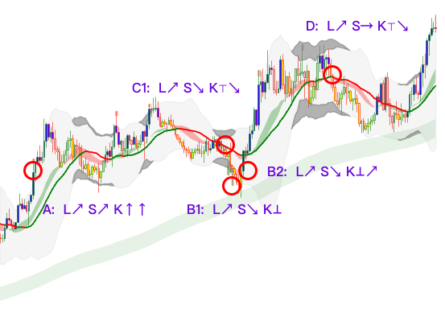

# Kpattern

A symbolic language for expressing candlestick trend structures.  
一种用于表达 K 线趋势结构的符号语言。

Kpattern is designed not only for human readability, but also as a structured prompt or annotation system for training AI models to recognize financial patterns from chart images.  
Kpattern 不仅方便人类理解，也可作为结构化提示词，用于训练 AI 模型识别图像中的金融图形结构。

下图展示了如何使用 KPattern 标注 K 线结构语言：



---

## 🌐 Language | 语言

- [English Documentation](./en/symbol_reference.md)
- [中文文档](./zh/symbol_reference.md)

## 📂 Repo Structure | 项目结构

```
Kpattern/
├── en/
│   ├── examples/
│   ├── json_schema/
│   ├── LICENSE
│   └── symbol_reference.md
├── zh/
│   ├── examples/
│   ├── json_schema/
│   ├── LICENSE
│   └── symbol_reference.md
├── README.md
```

---

## 📜 License

- [English LICENSE](./en/LICENSE)
- [中文 LICENSE](./zh/LICENSE)
