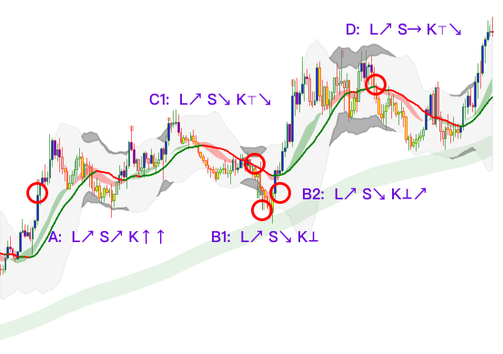

# Welcome to KPattern

**KPattern** is a symbolic language for expressing candlestick trend structures.  
It can also be used as annotation prompts to train AI to understand financial patterns from chart images.

---

## 🧠 Why KPattern?

- Easy to annotate complex chart behavior.
- Supports AI model training as structured prompt.
- Bilingual format: English + 中文.

---

## 🔍 Symbol Examples

See [symbol reference](../en/symbol_reference.md) and [examples](../en/examples/basic_patterns.md).

---

## 📷 Example Chart

